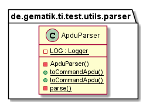

# Ti-Test-Utils

## Introduction

This part describes the Ti-Test-Utils functionalities and structure.
This utils are only for unit testing and not allowed for production execution.

## API Documentation

Generated API docs are available at <https://gematik.github.io/ref-Ti-Test-Utils>.

## License

Licensed under the [Apache License, Version 2.0](https://www.apache.org/licenses/LICENSE-2.0).

## Structure

### Overview

  

### ApduParser

This Parser create Apdus-Instances from byte arrays representations.

  

## Getting Started

### Build setup

To use Ti-Test-Utils library in a project, you need just to include following dependency:

**Gradle dependency settings to use Ti-Test-Utils library.**

    dependencies {
        implementation group: 'de.gematik.ti', name: 'test.utils', version: '1.1.1'
    }

**Maven dependency settings to use Ti-Test-Utils library.**

    <dependencies>
        <dependency>
            <groupId>de.gematik.ti</groupId>
            <artifactId>test.utils</artifactId>
            <version>1.1.1</version>
        </dependency>
    </dependencies>
